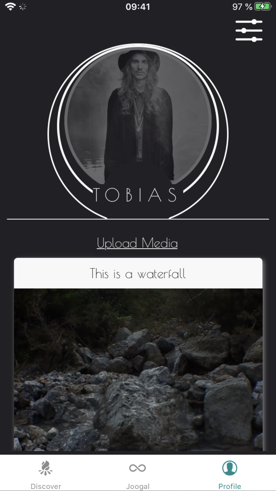
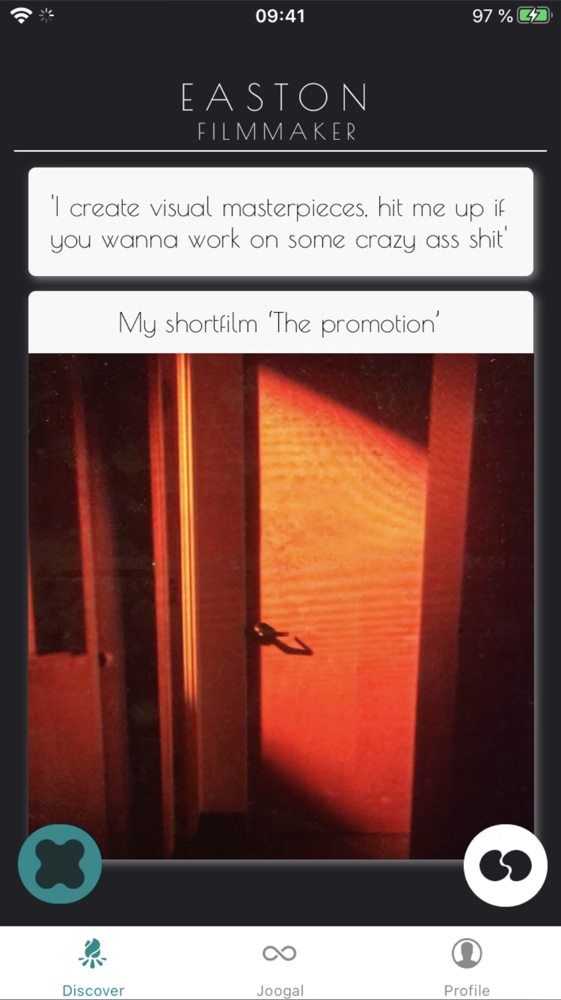
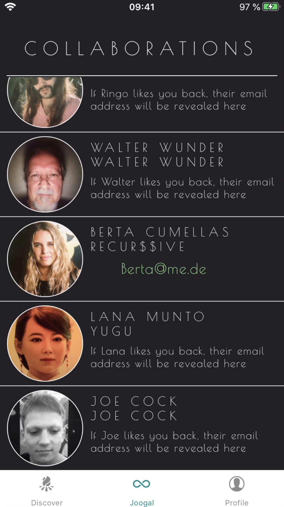

# Joogal
Find creative collaborators in the format of modern dating apps.

<p align="center">

</p>

#### Sign up, define your roles and showcase your work


#### Discover other creatives, filtered by preference and request a collaboration


#### Contact your matches via email to start collaborating


## About
Joogal is an app for creatives of all fields who want to find people for collaborations. 
Maybe a Rapper looking for a Beatmaker, or a Filmmaker looking for a Sound Designer.
If you like someones work, and they like yours you can start chatting and hopefully creating!

The MVP of Joogal (featured screenshots) was build in 5 days by Tobias Feltes followed by a 5 days period of adding test coverage by the amazing people below

## Tech Stack :computer:
- [JavaScript](https://www.javascript.com/)
- [React Native](https://reactnative.dev/)
- [Firebase](https://firebase.google.com/)
- [Koa](https://koajs.com/)
- [PostgreSQL](https://postgresql.org/)

## Future Tasks
```
- Refactoring
- Expand test coverage
- Add Chat feature
- Find supporters
- Deploy
```

## Would you like to be involved? :raising_hand_woman::raising_hand_man:
Contact me if you like the idea and want to get involved in any way!

## Contributors ✨

Big thanks and much respect goes to these wonderful people ([emoji key](https://allcontributors.org/docs/en/emoji-key)):

<!-- ALL-CONTRIBUTORS-LIST:START - Do not remove or modify this section -->
<!-- prettier-ignore-start -->
<!-- markdownlint-disable -->
<table>
  <tr>
    <td align="center"><a href="https://github.com/innaDE"><br /><sub><b>Inna Druzina</b></sub></a><br /> <a href="#test-innaDE" title="test">⚠️</a></td>
    <td align="center"><a href="https://github.com/pbroeker"><br /><sub><b>Philipp Broeker</b></sub></a><br /> <a href="#test-pbroeker" title="test">⚠️</a></td>
  </tr>
</table>

<!-- markdownlint-enable -->
<!-- prettier-ignore-end -->
<!-- ALL-CONTRIBUTORS-LIST:END -->

This project follows the [all-contributors](https://github.com/all-contributors/all-contributors) specification. Contributions of any kind welcome!
